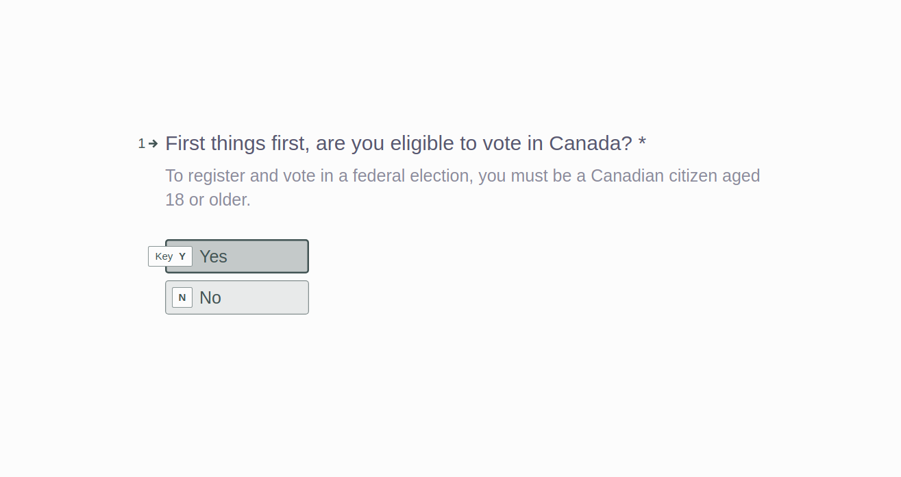
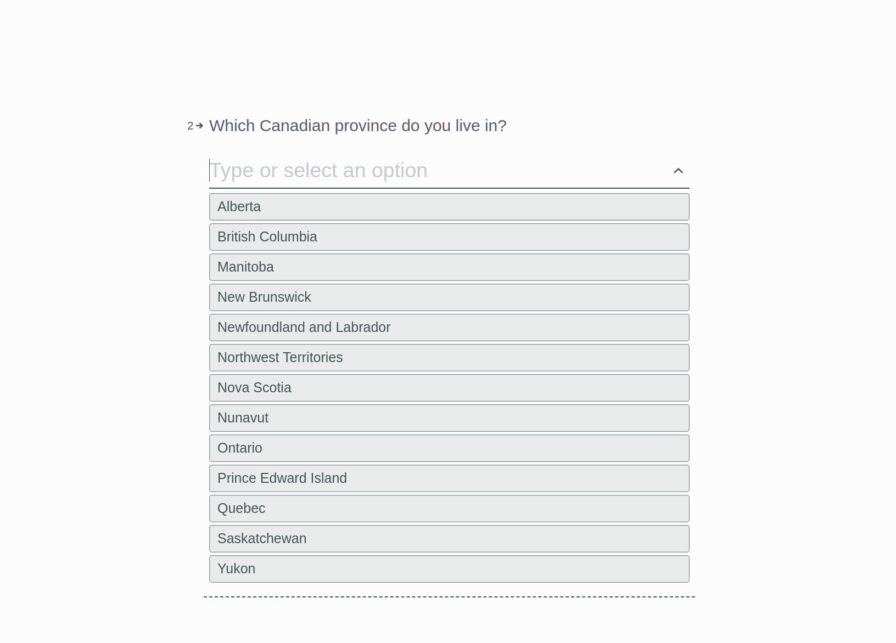
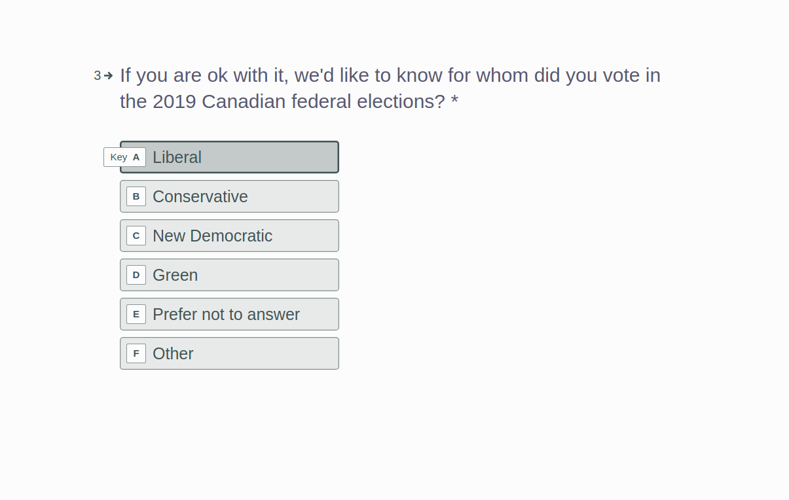
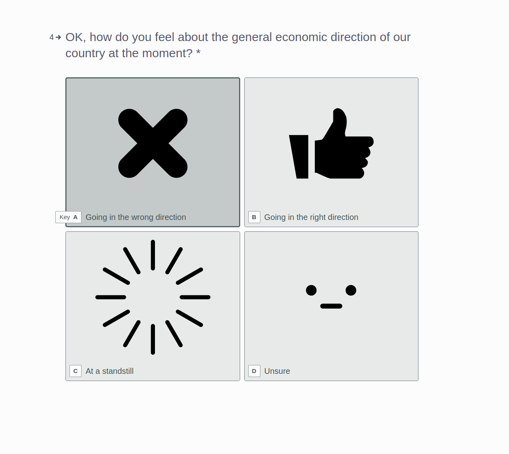
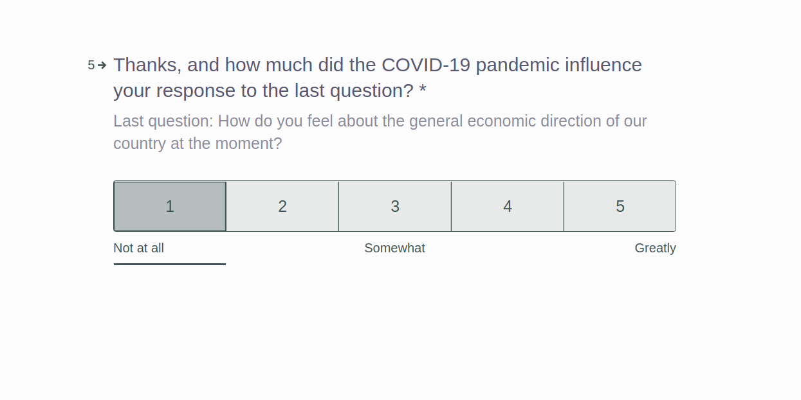
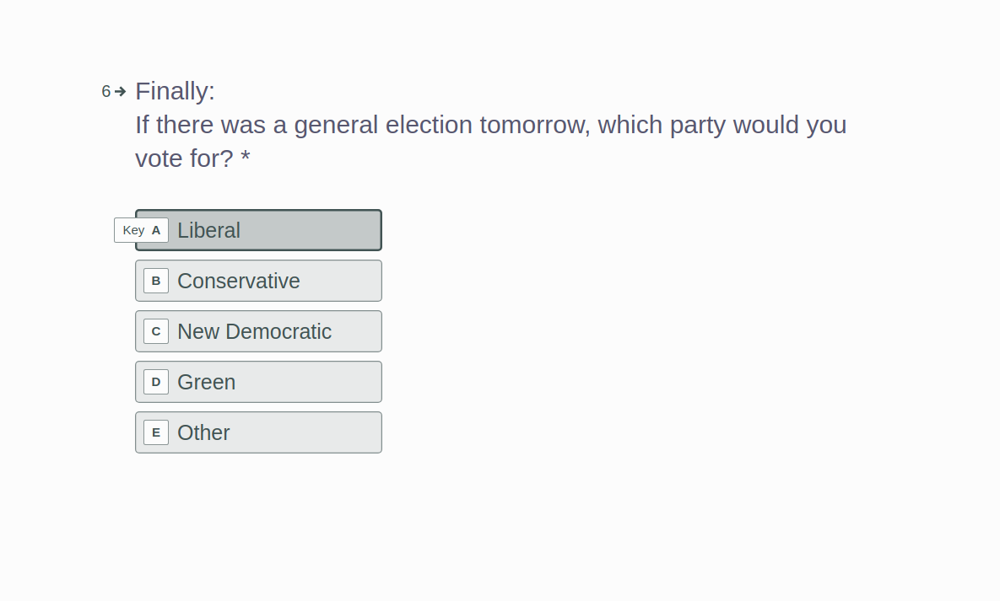

```{r, include=FALSE}
# bibliography: bib.bibtex
## Libraries and initial values
library(tidyverse)
library(cowplot)

data <- read.csv("survey_data.csv")

# Clean data
data.clean <- data[!is.na(data$Q2), ] # If there is NA in Q2 then there also in
# Q4, this suffices.

#### Computation of stratum Weights and stratum sample sizes
# Generate table of frequencies for distribution of provinces
strat.sizes <- table(data$Province)

# Extract information from .txt file with population sizes
provinces <- read_lines(file = "./scripts/provinces.txt")

# Split string by "Province Name : Population"
provinces <- strsplit(provinces, ":")
# Generate stratum sample sizes
N <- as.numeric(provinces[[1]][2]); n <- 10000
W_h <- c(); prov <- c(); sizes <- c()

# Calculates n_h for each province
for( i in 2:14) {
  W_h <- c(W_h, as.numeric(provinces[[i]][2]) / N)
  p <- gsub('[0-9]+', '', provinces[[i]][1])
  prov <- c(prov, p)
  sizes <- c(sizes, strat.sizes[[p]])
} 
strat.n.w <- data.frame(province = prov, weights = W_h, size = sizes)
rm(i, n, N, p)

strat.n.w <- strat.n.w[order(strat.n.w$province), ]


#### Calculation of stratified sample mean for selected variables
# Recall strat.n.w is a dataframe with province sample sizes and weights

# Select variable to study
q2.liberals <- subset(data.clean, Q2 == "Liberal")
q5.liberals <- subset(data.clean, Q5 == "Liberal")

# Group by stratum and calculate ybar
# Estimation of stratified sample mean for question 3
q2.by.strata <- q2.liberals %>% group_by(Province) %>% count()
q2.ybar.strata <- q2.by.strata$n / strat.n.w$size
q2.ybar <- sum(q2.ybar.strata * strat.n.w$weights)

# Estimation of stratified sample mean for question 6
q5.by.strata <- q5.liberals %>% group_by(Province) %>% count()
q5.ybar.strata <- q5.by.strata$n / strat.n.w$size
q5.ybar <- sum(q5.ybar.strata * strat.n.w$weights)

# Estimation of variance for the stratified sample mean

#Gather province populations
provinces <- read_lines(file = "./scripts/provinces.txt")
provinces <- sort(provinces[2:length(provinces)])
provinces <- strsplit(provinces, ":")
provinces <- as.integer(sapply(provinces, "[[", 2))

# Computation of unbiased variance estimator for ybar
q5.ss <- (q5.by.strata$n - q5.ybar)**2 / (strat.n.w$size - 1)
q5.var <- (strat.n.w$weights^2) * (1- (strat.n.w$size / provinces)) * (q5.ss / strat.n.w$size)
q5.var <- sum(q5.var)

# Computation of the 90% confidence interval for ybar
z <- qnorm(.1,lower.tail=FALSE)
q5.ci.L <- q5.ybar - (z*sqrt(q5.var))
q5.ci.U <- q5.ybar + (z*sqrt(q5.var))

# Population estimation of Economy moving in the wrong direction
q3.wrong <- subset(data.clean, Q3 == "Wrong")

# Estimation of stratified sample mean for question 4
q3.by.strata <- q3.wrong %>% group_by(Province) %>% count()
q3.ybar.strata <- q3.by.strata$n / strat.n.w$size
q3.ybar <- sum(q3.ybar.strata * strat.n.w$weights)

# Computation of unbiased variance estimator for ybar
q3.ss <- (q3.by.strata$n - q3.ybar)**2 / (strat.n.w$size - 1)
q3.var <- (strat.n.w$weights^2) * (1- (strat.n.w$size / provinces)) * (q3.ss / strat.n.w$size)
q3.var <- sum(q3.var)

# Computation of the 90% confidence interval for ybar
q3.ci.L <- q5.ybar - (z*sqrt(q3.var))
q3.ci.U <- q5.ybar + (z*sqrt(q3.var))

### Population estimation of Economy at a standstill
q3.stand <- subset(data.clean, Q3 == "Standstill")

# Estimation of stratified sample mean for question 4
q32.by.strata <- q3.stand %>% group_by(Province) %>% count()
q32.ybar.strata <- q32.by.strata$n / strat.n.w$size
q32.ybar <- sum(q32.ybar.strata * strat.n.w$weights)

# Computation of unbiased variance estimator for ybar
q32.ss <- (q32.by.strata$n - q32.ybar)**2 / (strat.n.w$size - 1)
q32.var <- (strat.n.w$weights^2) * (1- (strat.n.w$size / provinces)) * (q32.ss / strat.n.w$size)
q32.var <- sum(q32.var)

# Computation of the 90% confidence interval for ybar
q32.ci.L <- q5.ybar - (z*sqrt(q32.var))
q32.ci.U <- q5.ybar + (z*sqrt(q32.var))
```


## Executive Summary
In this experiment we conduct a, simulation based, survey study
to investigate Canadian's political views and how it has been affected by the 
negative economic consequences brought by the COVID-19 pandemic. The study is conducted by random selection
of participants from 13 pools of candidates corresponding to the different Canadian
provinces. An invitation is first sent to a selected candidate and upon registration,
administration of the survey is done by email. The survey is coupled with a small
monetary incentive ($5 coupon) which is rewarded upon completion of the survey. 
This study is designed using the tool www.typeform.com. No personal data
is collected to protect the privacy of respondents.

Research has long suspected on the correlation between the length of a survey
and response rate. As a result, we decided
to limit the survey to five questions:

1. Are you eligible to vote?
2. Which Canadian province do you live in?
2. For whom did you vote in the 2019 Canadian federal elections?
3. How do you feel about the economic direction of our country at the moment? 
4. How much did the COVID-19 pandemic influence your response to the last question?
5. If there was a general election tomorrow, which party would you vote for?

Responses where simulated based on data collected from a list of news videos 
in which a representative of the Liberal party either speaks about the economic
situation due to the pandemic, or addresses the pandemic as a whole. 
The videos used where from September and first week of October. 
Data collected includes: _number of views_,
_number of likes_, _number of dislikes_ and _number of comments_. 

We focus our study on quantifying the number of lost/gained votes in favor of the
Liberal Party. Figure 1 displays the raw data collected for questions three and
six. This figure helps to visualize the actual findings of the study.
\pagebreak
```{r fig1, echo=FALSE, warning=FALSE, fig.height = 4, fig.width = 7, fig.align = "center", error=FALSE, message=FALSE, fig.cap="Results for questions 3 and 6"}
# Set percentages for question 2
q2.plot.data <- data.clean %>%
  group_by(Q2) %>% summarise(count = n()) %>%
  mutate(perc = count / sum(count))

# Set percentages for question 4
q5.plot.data <- data.clean %>%
  group_by(Q5) %>% summarise(count = n()) %>%
  mutate(perc = count / sum(count))

# Question 2 frequency plot
p1 <- ggplot(data=subset(q2.plot.data, !is.na(q2.plot.data$Q2)), aes(x=factor(Q2), y=perc*100)) +
  geom_bar(stat="identity", fill=I("steelblue4"), alpha = I(.9)) + 
  theme_light() + 
  labs(title = "2019 Canadian elections vote choice") + 
  xlab("Vote Choice") + ylab("Percentage of Votes (%)") + 
  theme(axis.text.x = element_text(angle = 90, vjust = 0.5, hjust=1), 
        text = element_text(size=10)) + ylim(0, 80) 

# Question 5 frequency plot
p2 <- ggplot(data=q5.plot.data, aes(x=factor(Q5), y=perc*100)) +
  geom_bar(stat="identity", fill=I("grey23"), alpha = I(.9)) + 
  theme_light() + 
  labs(title = "Estimated Current Vote choice") + 
  xlab("Vote Choice") + ylab("Percentage of Votes (%)") + 
  theme(axis.text.x = element_text(angle = 90, vjust = 0.5, hjust=1), 
        text = element_text(size=10)) + ylim(0, 80) 

# Plot as a single figure
plot_grid(p1, p2)	
```

After statistical analysis of the data we suspect an approximate loss of 
**`r round(100*(q2.ybar - q5.ybar), digits=2)`%** of votes in favour of the
Liberal party, and estimate **`r round(100*(q3.ybar + q32.ybar), digits=0)`%**
of Canadians feel our economy is moving in the wrong direction or is at a 
standstill. 

Some major weakness to our approach lie in the simplicity of the survey. We
believe a longer study should be carried out, as future work, to gather more information on the
social aspects that society thinks are the most impacted by COVID-19, given the 
majority of the Canadian leadership is formed by Liberal party members. We particularly
chose economic impact as the focus given empirical evidence of the negative effects
of the pandemic in Canada's and the world economy.

## Introduction

There is enough evidence to make the claim that the COVID-19 pandemic has nearly 
created a state of economic collapse in Canada. What is worse is that 
this second wave promises to be more severe than the first one.
Strict measures where taken by Canadian leadership
as a countermeasure to the spread of the virus. These measures produced an overwhelming amount
of jobs being lost and businesses that are now in a state of bankruptcy. 
With this as primary motivation, we claim there has been a shift
in the acceptance of the Canadian Liberal party as a result of these measures.
This experiment attempts to quantify such claims and evaluate its implications.

In the next section, there is a thorough discussion on the methodology of the study conducted,
in this section we discuss logistics, statistical basis and costs, to name a few
components. This is followed by the results obtained, which quantify and provide
evidence to
the original claim. Finally there is a short discussion on the weaknesses of our
methods and areas of future work. References to the survey, code and data modeling
methods can be found in the Appendix.


## Survey Methodology
In this section we discuss all aspects of the design of the experiment.
First we talk about logistics, statistical basis, frame, sampling methodology 
and methods for non-responses this is then followed by content of the survey and 
costs. 

We conduct the experiment as a web survey created using Typeform as our survey design
platform. 
A complete list of Canadian addresses has been provided and is used as frame for
the survey. We follow stratified simple random sampling as our design, with each
province as strata. The selection of candidates is by simple random sampling
without replacement (SRSWOR). The selected candidate is sent an invitation with registration
steps. If the candidate accepts, we send
an email with a link to the survey and upon completion, the survey redirects
users to a $5 CAD coupon reward. In the case the candidate does not accept, we draw another 
candidate following the same SRSWOR method, this is repeated until the desired
sample size of $n=10,000$ is reached. 

The number of candidates we select from each province is calculated using 
proportional allocation. Say the population has size $N$ and the population
of province $h$ is $N_h$, then the number of samples to draw from province $h$
is 
\[n_h=\frac{n}{N}N_h\]
where $n$ is the total sample size. Similarly, we compute the stratum weight,
which is the relative size of the stratum within the overall population, a needed
quantity for population parameter estimation. The stratum weight of province $h$ 
is given by $W_h=n_h/n$
where $n_h$ is as above [@wunthom]. A complete table of strata sample sizes
and weights can be found in Table 1 in the Appendix.

To ensure a high response rate we selected a small
set of questions. This is because, research has long showed some correlation
between the length of a survey and response rate, for example, an experiment evaluating
redesigns of the U.S. Census found 
that shortening the questionnaire increased response rate [@dillman], a more
recent experiment showed a sizable negative
effect of length on completion in web surveys [@marcus]. 

In constructing the survey, we followed @fanyan very closely. In particular 
they suggests that the optimal survey should take less than thirteen minutes 
to complete. Our survey takes approximately two to four minutes with the
following questions:

1. Are you eligible to vote?
2. Which Canadian province do you live in?
2. For whom did you vote in the 2019 Canadian federal elections?
3. How do you feel about the economic direction of our country at the moment? 
4. How much did the COVID-19 pandemic influence your response to the last question?
5. If there was a general election tomorrow, which party would you vote for?

Questions are presented in this order and not randomized given there is no 
empirical result that either proves or disproves the efficiency of randomization.
The actual wording of the questions is different than what is presented above, 
because the language used is significantly less formal, done with the intention
of establishing a more conversational type interaction and
yield higher response rates. The third question has the option to not provide
an answer since we understand this might be a sensitive topic and could negatively
impact our response rate. 

However, avoiding the question gives respondents an alternative, a way out,
to the cognitive burden
of the question which as a result makes them more likely to take this mental shortcut referred in 
the literature as satisficing [@krosnick]. Consequently, question two is the only question 
where this is allowed. 

Logic is implemented to the survey for question 1, if the respondent is not an
eligible voter then we only display questions four and five. Typeform fills
missing values with _NA_ and will not be included in the analysis, since we
are purposefully targeting eligible voters. All other questions are mandatory 
and we will discard any surveys that are left half answered. Finally, we clarify
that we do not ask for any personal information. This is with the purpose to ensure
anonymity for participants. We understand these questions consist of very 
sensitive topics. Screen shots of the survey can be found in the Appendix and we
advise the reader to look at these pictures before moving to the "Results and Discussion"
section.

The logic Typeform feature is only available under the professional plan. 
We used Typeform's 3 month free offering for anyone working on 
COVID-19 related projects that are strictly not-for-profit. Therefore, there is
no cost attached with this tool.
Hence, the expected cost for this project is broken down as follows. First the $5 CAD
monetary reward delivered upon completion of the survey, with a total of approximately 
$50,000 CAD. An estimated 20,000 invitations with a price of 
$0.92 CAD
per invitation sent and estimated total of $18,400 CAD, together with the cost 
for printing of $400 CAD. 
**Therefore, the expected cost of this experiment is of approximately $68,800 CAD**.

## Results and Discussion
In this section, we begin by displaying the modeled data in the form of frequency plots,
followed by a discussion of the data and statistical inferences. The last section
is reserved for a weaknesses and future work discussion. Data was pre-cleaned by removing all
NA values corresponding to all non-eligible respondents. The resulting sample size
is $n=8961$.

For convenience we group question
three and six. Recall question three asked participants which party did they vote for 
in the 2019 Federal elections, and question six asks to choose a party if 
general elections where held tomorrow. Similarly we grouped question four and
five, which asked about the general economic direction of our country and the
impact of COVID-19 in the participants response to question four. Figures 2 and 3
display the raw data simulated for this report.


```{r fig2, echo=FALSE, warning=FALSE, fig.height = 4, fig.width = 7, fig.align = "center", error=FALSE, message=FALSE, fig.cap="Answers for questions three and six."}

## The following code is used to generate plots for each question
# Generate frequencies
q2.plot.data <- data.clean %>%
  group_by(Q2) %>% summarise(count = n()) %>%
  mutate(perc = count / sum(count))

# Generate frequencies
q5.plot.data <- data.clean %>%
  group_by(Q5) %>% summarise(count = n()) %>%
  mutate(perc = count / sum(count))

#### PLOTS
p2 <- ggplot(data=subset(q2.plot.data, !is.na(q2.plot.data$Q2)), aes(x=factor(Q2), y=perc*100)) +
  geom_bar(stat="identity", fill=I("darkorange4"), alpha = I(.9)) + 
  theme_light() + 
  labs(title = "Q3: 2019 Canadian elections vote choice") + 
  xlab("Vote Choice") + ylab("Percentage of Votes (%)") + 
  theme(axis.text.x = element_text(angle = 90, vjust = 0.5, hjust=1), 
        text = element_text(size=10)) + ylim(0, 80) 

p5 <- ggplot(data=q5.plot.data, aes(x=factor(Q5), y=perc*100)) +
  geom_bar(stat="identity", fill=I("red4"), alpha = I(.9)) + 
  theme_light() + 
  labs(title = "Q6: Current Vote choice") + 
  xlab("Vote Choice") + ylab("Percentage of Votes (%)") + 
  theme(axis.text.x = element_text(angle = 90, vjust = 0.5, hjust=1), 
        text = element_text(size=10)) + ylim(0, 80) 


q3.plot.data <- data %>%
  group_by(Q3) %>% summarise(count = n()) %>%
  mutate(perc = count / sum(count))

p3 <- ggplot(data=q3.plot.data, aes(x=factor(Q3), y=perc*100)) +
  geom_bar(stat="identity", fill=I("darkslategrey"), alpha = I(.9)) + 
  theme_light() + 
  labs(title = "Q4: Direction of Canadian economy.") + 
  xlab("Answer") + ylab("Percentage of answers (%)") + 
  theme( text = element_text(size=10)) + ylim(0, 80) 


 
q4.plot.data <- data %>%
  group_by(Q4) %>% summarise(count = n()) %>%
  mutate(perc = count / sum(count))

p4 <- ggplot(data=q4.plot.data, aes(x=factor(Q4), y=perc*100)) +
  geom_bar(stat="identity", fill=I("royalblue4"), alpha = I(.8)) + 
  theme_light() + 
  labs(title = "Q5: Impact of COVID-19 to Q4 response.") + 
  xlab("Impact on a scale of 1-5") + ylab("Percentage of answers (%)") + 
  theme( text = element_text(size=10)) + ylim(0, 80) 

plot_grid(p2, p5)	
```
```{r fig3, echo=FALSE, warning=FALSE, fig.height = 4, fig.width = 7, fig.align = "center", error=FALSE, message=FALSE, fig.cap="Answers for questions four and five."}
plot_grid(p3, p4)	
```
\pagebreak
The raw data shows that there is an important percentage of respondents that are choosing 
to vote for another party which is not the Liberal party. Similarly more than half
of respondents feel like the Canadian economy is moving in the wrong direction 
or that is at a standstill. Moreover, approximately half of
respondents also claim that COVID-19 had a high impact on their
view of Canadian economy. However, this are just the raw results and we cannot 
make any empirical conclusions based just on these. 

Further analysis is required to support what the raw data shows at a glance. 
To properly estimate such population parameters we first require to calculate an
unbiased estimator for the population mean. Consider the stratified sample mean, given by 
\[\overline{y}_{st}=\sum_{h=1}^HW_h\overline{y}_h\]
where $W_h$, the stratum weight, is as in previous sections and $\overline{y}_h$
the sample mean for stratum $h$. Sample mean of stratum $h$ is given by:
\[\overline{y}_h=\frac{1}{n_h}\sum_{i\in S_h}y_i\]
Here, $S_h$ is the sample corresponding to stratum $h$.
This is important because, the stratified sample mean is an unbiased estimator of the population mean 
$\mu_y$, i.e.
\[E(\overline{y}_{st})=\mu_y\]
similarly an unbiased variance estimator for $\overline{y}_{st}$ is given by
\[v(\overline{y}_{st})=\sum_{h=1}^HW_h^2\left(1-\frac{n_h}{N_h}\right)\frac{s^2_{yh}}{n_h}\]
here $N_h$ is the total stratum population size. A proof of this
statement can be found in Theorem 3.1 in @wunthom pg. 36.


As per the introduction, the variable of interest is the percentage of votes
the Liberal party has with respect to the population. Then compare this number to 
what the current percentage of votes is estimated to be. Using the methods described
above, the estimated percentage of votes obtained in the 2019 election is
of **`r round(q2.ybar * 100, digits=2)`%**, and as a point of comparison, the actual 
percentage of votes with which the Liberal party won the 2019 Canadian elections is 39.47%.
Similarly, we estimate that the current percentage of votes is 
**`r round(q5.ybar*100, digits=2)`%** with a variance of `r round(q5.var * 100, digits=2)`%
and a 90% confidence
interval $CI_{votes} = [`r round(100*q5.ci.L, digits=2)`, `r round(100*q5.ci.U, digits=2)`]$. 
An approximate loss of `r round(100*(q2.ybar - q5.ybar), digits=2)`% of votes.


Using the same method, we estimate that **`r round(100*q3.ybar, digits=2)`%**
of Canadians feel the general economy is moving in the wrong direction, with a computed variance
of `r round(100* q3.var, digits=2)`% and a 90% confidence interval $CI_{w}[`r round(100*q3.ci.L, digits=2)`, `r round(100*q3.ci.U, digits=2)`]$.
Similarly **`r round(100*q32.ybar, digits=2)`%**
of Canadians feel the economy is at a standstill, with a computed variance
of `r round(100* q32.var, digits=2)`% and a 90% confidence interval $CI_s[`r round(100*q32.ci.L, digits=2)`, `r round(100*q32.ci.U, digits=2)`]$.

With these results, which support our original claim, we now discuss some of the 
weaknesses of our approach. The most significant come from 
the design of the survey. Although it has been justified the reason for the shortness of our survey, 
this is also a weakness because it does not provide nearly enough information
to study and discuss. Due to various factors we had to limit this study to two main results, the loss
of votes and the percentage of people that believe the Canadian economy is moving
in the wrong direction. This greatly limited our ability to create stronger 
conclusions because we are only considering one social aspect.
Moreover, this survey comes with a significant cost, nearly  $70,000 CAD. 
A non-probability, opt-in web survey offers the promise of being significantly cheaper,
and possibly generate a bigger sample size at the cost of theoretical complications. 

Future work could include a slightly longer survey, in which there is a large 
set of questions and with the use of active matrix factorization, we can 
automate the design of shorter surveys by a variance-minimizing active
learning criterion which chooses the most informative questions per respondent [@zhangtaylor].
This type of survey can be a non-probability based survey that attempts to gather 
at least $50,000$ samples and attempts to draw stronger conclusions.
More complex theoretical tools are required for the 
statistical analysis of such survey. 

\pagebreak

## Appendix
### Links
All code used in this project can be found at: 

- **https://github.com/cesar-yoab/survey_modelling**

The survey can be found at:

- **https://cesaryvillarrealg.typeform.com/to/XX9vwSu5**


### Data Modelling
Taken from the executive report: Responses where simulated based on data collected from a list of news videos 
in which a representative of the Liberal party either speaks about the economic
situation due to the pandemic, or addresses the pandemic as a whole. 
The videos used where from September and first week of October. 
Data collected includes: _number of views_,
_number of likes_, _number of dislikes_ and _number of comments_.
Such data was obtained by calling the YouTube API using code previously 
created for a web service. We have provided all code in the Github repository
however the code is written in Python and requires an API key which is not hard
to obtain. More instructions on how to obtain such key can be found in the README
under the "scripts" folder. 

Responses were mostly calculated based on the ratio of
likes versus dislikes. The only exceptions are the 2019 vote choice question 
which was sampled from a categorical distribution
with each probability being the ratio of final votes in the 2019 Canadian federal
election, and the eligibility question which was sampled from a Bernoulli distribution
with probability of being eligible $p=0.9$. The important question, for what party
would you vote if general elections where held tomorrow? Was modeled with the
ratio of likes as the probability of choosing liberal and the ratio of dislikes
was distributed among the other parties. More details can be found in the "scripts"
folder.

\pagebreak
## Table of Sample Sizes and Weights
```{r, echo=FALSE}
stratum <- data.frame(province = prov, weights = W_h, size = sizes)

#stratum <- stratum[order(stratum$province), ]
knitr::kable(stratum, caption = "Stratum Sizes and Weights", align = "lcr",
      col.names = c("Province", "Stratum Weight", "Stratum Sample Size"), digits = 3)
```
\pagebreak

## Screen shots

\pagebreak


\pagebreak


\pagebreak


\pagebreak


\pagebreak


\pagebreak


\pagebreak


\pagebreak


---
nocite: '@*'
---

## References
